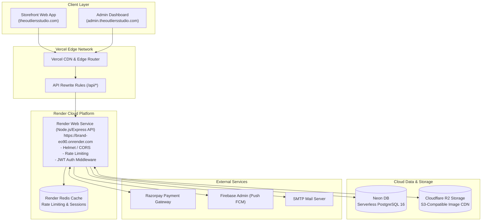
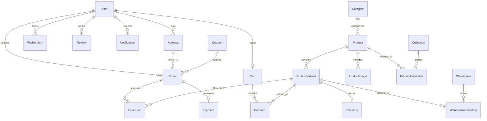
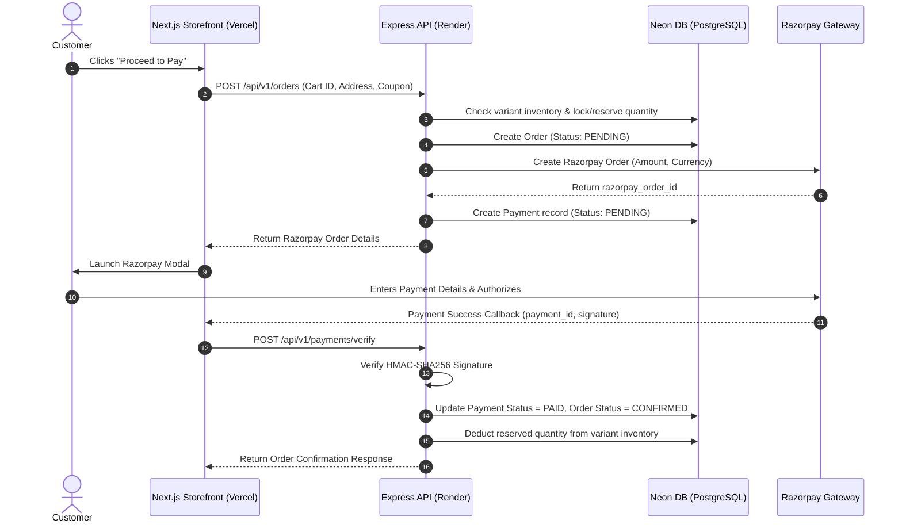

# Tevar Fashion Brand — Technical Architecture & Tech Stack Documentation

## 1. Executive Summary

**Tevar** is an enterprise-grade, high-performance E-Commerce platform designed specifically for modern fashion retail. The system features a production topology separating a high-speed **Next.js 16 Storefront & Admin Portal** (hosted on **Vercel**) from a robust **Node.js/Express REST API Server** (hosted on **Render**).

The data & infrastructure stack is powered by **Neon DB** (Serverless PostgreSQL), **Render Redis**, **Cloudflare R2 Storage** (S3-compatible bucket for zero-egress asset CDN), **Razorpay** payment gateway, and **Firebase / Nodemailer** notifications.

---

## 2. Technology Stack & Infrastructure

### 2.1 Cloud Hosting & Deployment Infrastructure

| Infrastructure Layer | Service / Provider | Purpose & Specifications |
| :--- | :--- | :--- |
| **Frontend Hosting** | **Vercel Edge Network** | Global CDN deployment for Next.js App Router, automatic SSL, edge route rewrites to Render backend. |
| **Backend API Hosting** | **Render Web Service** | Managed Node.js runtime environment running Express API (`https://brand-eo90.onrender.com`). |
| **Primary Database** | **Neon DB** | Serverless, autoscaling PostgreSQL 16 database with instant branching & connection pooling. |
| **Caching & Rate Limiting** | **Render Redis** | Managed Redis instance with LRU eviction policy for API rate limiting (`rate-limit-redis`) and session cache. |
| **Object Storage & CDN** | **Cloudflare R2** | High-performance, zero-egress S3-compatible bucket (`@aws-sdk/client-s3`) & Cloudinary for product image storage. |

### 2.2 Frontend Stack (Storefront & Admin Dashboard)

| Component / Layer | Technology | Key Details & Purpose |
| :--- | :--- | :--- |
| **Framework** | Next.js 16.2 (App Router) | Server-Side Rendering (SSR), Static Site Generation (SSG), and Vercel edge deployment. |
| **UI Library & React** | React 19.2 | High-performance dynamic component rendering. |
| **Styling & Design System** | Tailwind CSS v4 + tw-animate-css | Utility-first responsive styling, custom theme variables, smooth micro-interactions. |
| **Component Primitives** | Radix UI / @shadcn/react | Accessible headless UI primitives (Dialogs, Dropdowns, Tabs, Modals). |
| **State Management** | Zustand v5 | Lightweight client state management (Cart, User session, Theme preferences). |
| **Animations & Motion** | Framer Motion v12 | Hardware-accelerated transitions, carousel motion, page animations. |
| **Tables & Data Display** | TanStack Table v8 | Enterprise data tables with pagination, sorting, filtering in Admin Dashboard. |
| **Data Visualization** | Recharts v3 & D3-Geo | Interactive revenue analytics, sales trends, geographic order distribution maps. |
| **Drag & Drop** | @dnd-kit (core, sortable) | Drag-and-drop product gallery reordering & layout builder. |
| **Form Management** | React Hook Form + Zod | Schema-validated form submissions with client-side error handling. |

### 2.3 Backend API & Core Infrastructure

| Component / Layer | Technology | Key Details & Purpose |
| :--- | :--- | :--- |
| **Runtime & Server** | Node.js (ES Modules) + Express 4.21 | Modular, asynchronous RESTful API architecture running on Render Web Service. |
| **Database ORM** | Prisma ORM 5.22 | Type-safe query building, migration management, complex relation modeling for Neon DB. |
| **Database** | Neon DB (PostgreSQL 16) | Cloud serverless PostgreSQL with connection pooling & full-text search vector. |
| **In-Memory Cache & Redis** | Render Redis | Managed Redis 7 instance for distributed rate-limiting (`rate-limit-redis`) and session cache. |
| **Asset Storage** | Cloudflare R2 + Cloudinary | S3-compatible bucket via `@aws-sdk/client-s3` for product images with zero egress costs. |
| **Authentication & AuthZ** | JWT + Bcryptjs (12 rounds) | Dual-token authentication (Access 15m + Refresh 7d) with Role-Based Access Control (`USER`, `ADMIN`, `SUPER_ADMIN`). |
| **Input Validation** | Zod 3.24 | Runtime type safety & strict API body/query validation middleware. |
| **Security Headers** | Helmet 8 & CORS | OWASP security header compliance, configurable origin validation. |
| **Logging & Diagnostics** | Winston 3.17 + Morgan | Structured daily file logging, levels, HTTP request logs. |

---

## 3. High-Level System Architecture



---

## 4. Database Schema & Data Modeling

The platform relies on Neon DB (PostgreSQL) managed through Prisma ORM with soft deletes, strict indexes, and relational integrity.



---

## 5. End-to-End Data Flow & Key Lifecycles

### 5.1 Authentication & Session Management
1. User logs in with email & password via `/api/v1/auth/login`.
2. Render API verifies bcrypt hash, generates a **Short-lived Access Token (JWT - 15m)** and a **Long-lived Refresh Token (JWT - 7d)**.
3. Refresh token hash is stored in Neon DB / Render Redis; client holds JWT securely for authorization headers.
4. Admin endpoints verify `Role.ADMIN` or `Role.SUPER_ADMIN` claims.

### 5.2 E-Commerce Order & Payment Processing


---

## 6. Security, Compliance & Performance Optimizations

### 6.1 Security Standards
* **HMAC Signature Validation**: Prevents payment tampering by verifying Razorpay signatures on the server before confirming order status.
* **Brute-Force & Rate-Limiting**: Express API routes protected via `express-rate-limit` using Render Redis backstore.
* **SQL Injection & XSS Protection**: Prisma ORM parameterized queries prevent SQL injection; Helmet sets strict CSP, HSTS, and Frameguard headers.
* **Password Hashing**: Bcrypt with work factor of 12 rounds.

### 6.2 Performance Tuning
* **Cloudflare R2 CDN**: Zero-egress fee object storage bucket for instant image serving.
* **Render Redis Caching**: Caching active product catalog responses and user sessions to minimize database query latency.
* **Neon DB Connection Pooling**: Auto-scaling connection pool to prevent connection exhaustion on serverless workloads.
* **Next.js Vercel Edge Optimization**: Static generation for marketing pages, SSG/ISR for category listings, dynamic route rewrites to Render backend.

---

## 7. Deployment Configuration Summary

```yaml
Hosting & Deployment Topology:
  Frontend:
    Provider: Vercel
    Framework: Next.js 16 (App Router)
    Rewrites: /api/:path* -> https://brand-eo90.onrender.com/api/:path*

  Backend API:
    Provider: Render Web Service
    Service: tevar-backend (Node.js 20 runtime)
    Build Command: npm install && npx prisma generate
    Start Command: npx prisma migrate deploy && npm start

  Redis Cache:
    Provider: Render Redis
    Service: tevar-redis
    Policy: allkeys-lru

  Database:
    Provider: Neon DB (Serverless PostgreSQL 16)
    URL: DATABASE_URL (pooled connection)

  Image Storage:
    Provider: Cloudflare R2 (S3 API via @aws-sdk/client-s3) & Cloudinary
```
