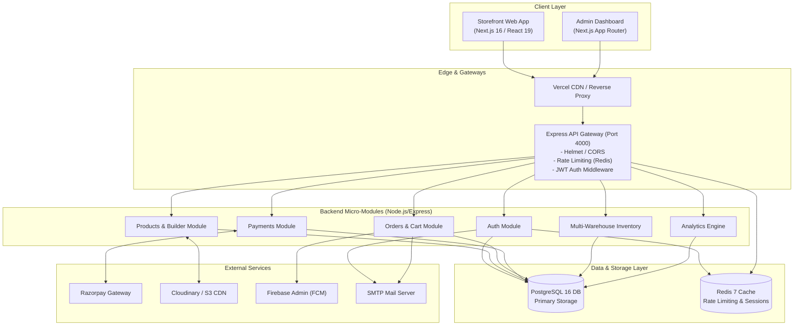
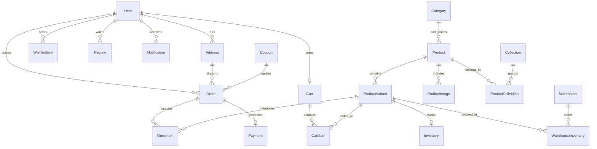
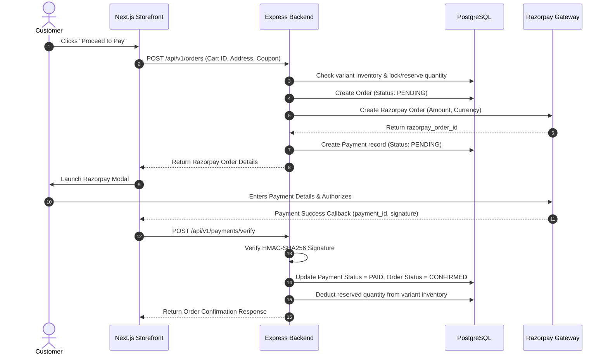

# Tevar Fashion Brand — Technical Architecture & Tech Stack Documentation

## 1. Executive Summary

**Tevar** is an enterprise-grade, high-performance E-Commerce platform designed specifically for modern fashion retail. The system features a decoupling between a high-speed **Next.js 16 Storefront & Admin Portal** and a robust **Node.js/Express REST API Server** powered by **Prisma ORM**, **PostgreSQL 16**, and **Redis 7**. 

The platform supports end-to-end e-commerce workflows, including complex product variant builder, multi-warehouse inventory management, Razorpay payment gateway integration, real-time analytics dashboard, coupon engine, dynamic wishlist, ratings & reviews, and transactional notifications.

---

## 2. Technology Stack

### 2.1 Frontend Architecture (Storefront & Admin Dashboard)

| Component / Layer | Technology | Key Details & Purpose |
| :--- | :--- | :--- |
| **Framework** | Next.js 16.2 (App Router) | Server-Side Rendering (SSR), Static Site Generation (SSG), and API Route handlers. |
| **UI Library & React** | React 19.2 | High-performance dynamic component rendering. |
| **Styling & Design System** | Tailwind CSS v4 + tw-animate-css | Utility-first responsive styling, custom theme variables, smooth micro-interactions. |
| **Component Primitives** | Radix UI / @shadcn/react | Accessible headless UI primitives (Dialogs, Dropdowns, Tabs, Modals). |
| **State Management** | Zustand v5 | Lightweight client state management (Cart, User session, Theme preferences). |
| **Animations & Motion** | Framer Motion v12 | Hardware-accelerated transitions, carousel motion, page animations. |
| **Tables & Data Display** | TanStack Table v8 | Enterprise data tables with pagination, sorting, filtering in Admin Dashboard. |
| **Data Visualization** | Recharts v3 & D3-Geo | Interactive revenue analytics, sales trends, geographic order distribution maps. |
| **Drag & Drop** | @dnd-kit (core, sortable) | Drag-and-drop product gallery reordering & layout builder. |
| **Form Management** | React Hook Form + Zod | Schema-validated form submissions with client-side error handling. |

### 2.2 Backend API Services & Core Infrastructure

| Component / Layer | Technology | Key Details & Purpose |
| :--- | :--- | :--- |
| **Runtime & Server** | Node.js (ES Modules) + Express 4.21 | Modular, asynchronous RESTful API architecture running with `tsx` runner. |
| **Database ORM** | Prisma ORM 5.22 | Type-safe query building, migration management, complex relation modeling. |
| **Primary Database** | PostgreSQL 16 (Alpine) | ACID-compliant relational DB, indexed schema for products, orders, users, & full-text search vector. |
| **In-Memory Cache & Redis** | Redis 7 (Alpine) | Session caching, distributed rate-limiting (`rate-limit-redis`), LRU memory policy. |
| **Authentication & AuthZ** | JWT + Bcryptjs (12 rounds) | Dual-token authentication (Access 15m + Refresh 7d) with Role-Based Access Control (`USER`, `ADMIN`, `SUPER_ADMIN`). |
| **Input Validation** | Zod 3.24 | Runtime type safety & strict API body/query validation middleware. |
| **Security Headers** | Helmet 8 & CORS | OWASP security header compliance, configurable origin validation. |
| **Logging & Diagnostics** | Winston 3.17 + Morgan | Structured daily file logging, levels, HTTP request logs. |

### 2.3 Third-Party Cloud Integrations & Services

* **Payment Gateway**: **Razorpay** (Order creation, Checkout modal integration, Webhook handling with HMAC signature validation).
* **Media Storage & CDN**: **Cloudinary** & **AWS S3** (`@aws-sdk/client-s3`) (Automated image upload, thumbnail generation, variant picture storage).
* **Notification Engine**: **Firebase Admin SDK 14** (Push notifications, mobile messaging) & **Nodemailer** (SMTP integration for transactional order emails and password resets).
* **Containerization & Deployment**: **Docker & Docker Compose** (Containerized PostgreSQL, Redis, and Express API server with health-check contracts).

---

## 3. High-Level System Architecture



---

## 4. Database Schema & Data Modeling

The platform relies on PostgreSQL managed through Prisma ORM with soft deletes, strict indexes, and relational integrity.



### Core Schema Models Summary

1. **Users & Addresses (`users`, `addresses`)**: Manages identity, salted bcrypt password hashes, OAuth tokens, email verification tokens, and role-based permissions (`USER`, `ADMIN`, `SUPER_ADMIN`).
2. **Products & Variants (`products`, `product_variants`, `product_images`)**: Product catalog supporting options (Size, Color, Material), price snapshots, compare prices, cost prices, weight, SKU tracking, and tag arrays.
3. **Multi-Warehouse Inventory (`inventory`, `warehouses`, `warehouse_inventory`)**: Tracks global variant quantity, reserved items for pending orders, and per-warehouse location stock breakdown.
4. **Collections & Categories (`categories`, `collections`, `product_collections`)**: Flexible categorization with unique handles/slugs for SEO URL structuring.
5. **Carts & Wishlists (`carts`, `cart_items`, `wishlist_items`)**: Persistent customer cart and wishlist items per user.
6. **Coupons (`coupons`)**: Discount engine supporting percentage or flat value discounts, usage limits, minimum order thresholds, and expiry tracking.
7. **Orders & Payments (`orders`, `order_items`, `payments`)**: Full lifecycle order management (`PENDING`, `CONFIRMED`, `PROCESSING`, `SHIPPED`, `DELIVERED`, `CANCELLED`, `REFUNDED`), tracking numbers, price snapshots, and Razorpay signature verification details.
8. **Reviews & Notifications (`reviews`, `notifications`)**: Customer rating/review system with admin moderation flag, alongside in-app notification center.

---

## 5. End-to-End Data Flow & Key Lifecycles

### 5.1 Authentication & Session Management
1. User logs in with email & password via `/api/v1/auth/login`.
2. Backend verifies bcrypt hash, generates a **Short-lived Access Token (JWT - 15m)** and a **Long-lived Refresh Token (JWT - 7d)**.
3. Refresh token hash is stored in PostgreSQL/Redis; client holds JWT securely for authorization headers.
4. Admin endpoints verify `Role.ADMIN` or `Role.SUPER_ADMIN` claims.

### 5.2 E-Commerce Order & Payment Processing


---

## 6. Security, Compliance & Performance Optimizations

### 6.1 Security Standards
* **HMAC Signature Validation**: Prevents payment tampering by verifying Razorpay signatures on the server before confirming order status.
* **Brute-Force & Rate-Limiting**: Express API routes protected via `express-rate-limit` with Redis backstore.
* **SQL Injection & XSS Protection**: Prisma ORM parameterized queries prevent SQL injection; Helmet sets strict CSP, HSTS, and Frameguard headers.
* **Password Hashing**: Bcrypt with work factor of 12 rounds.

### 6.2 Performance Tuning
* **Redis Caching**: Caching active product catalog responses and user sessions to minimize database query latency.
* **PostgreSQL Indexing**: Composite indexes on `[product_id]`, `[handle]`, `[user_id]`, `[status]`, and full-text search vector (`search_vector`).
* **Next.js Rendering**: Static generation for marketing pages, Server Side Rendering for dynamic category listings, and client-side dynamic fetching for real-time stock status.

---

## 7. Operational Deployment & Environment Layout

### Docker Container Orchestration (`docker-compose.yml`)

```yaml
Services:
  - postgres:
      Image: postgres:16-alpine
      Port: 5432
      Volume: postgres_data
      Healthcheck: pg_isready

  - redis:
      Image: redis:7-alpine
      Port: 6379
      Volume: redis_data
      Policy: allkeys-lru (Max 256MB)

  - backend:
      Build: ./backend
      Port: 4000
      Environment: Node production
      Depends On: postgres (healthy), redis (healthy)
```
