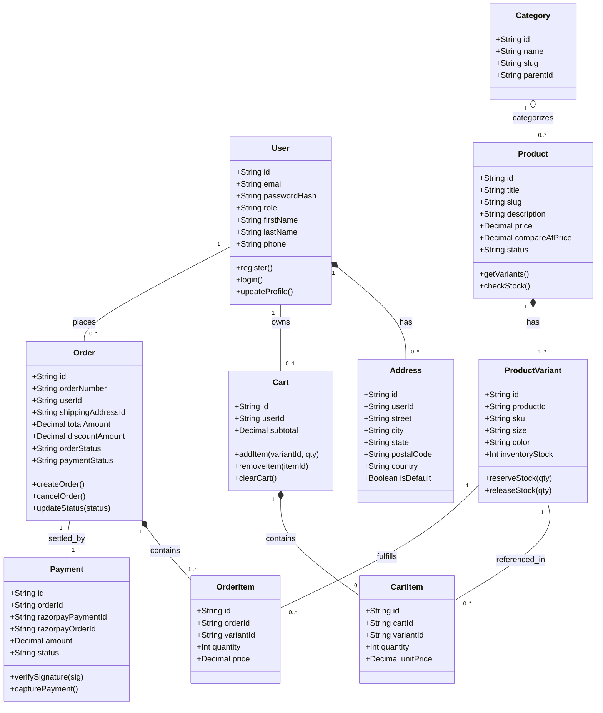
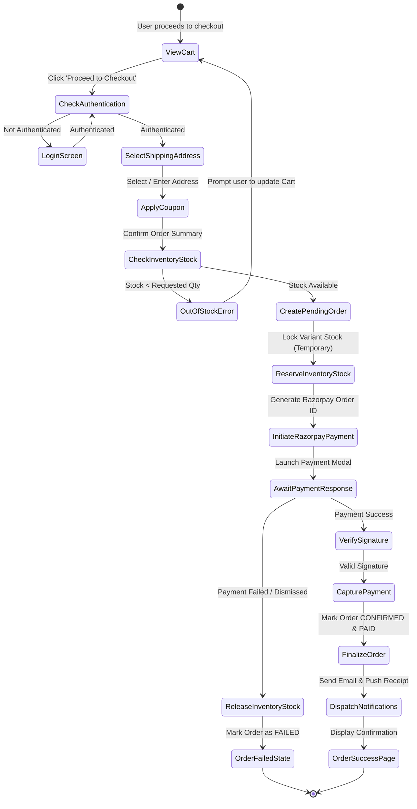
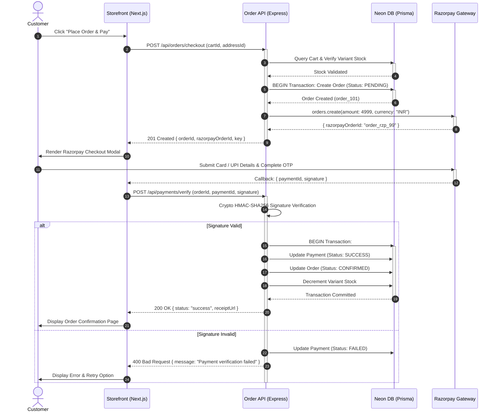
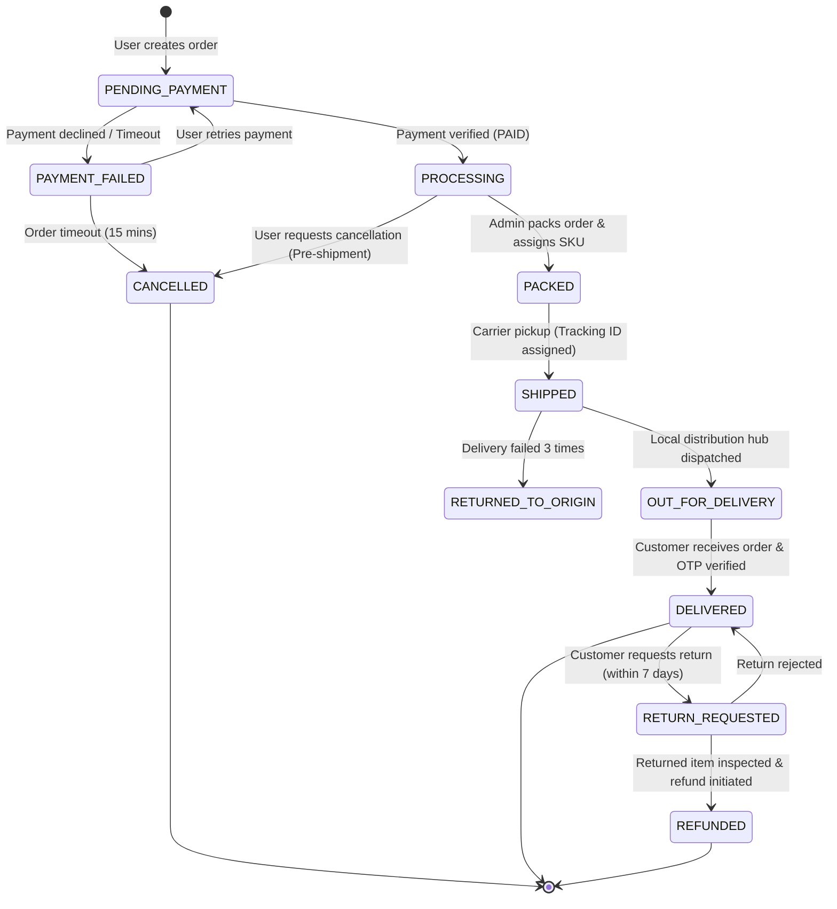
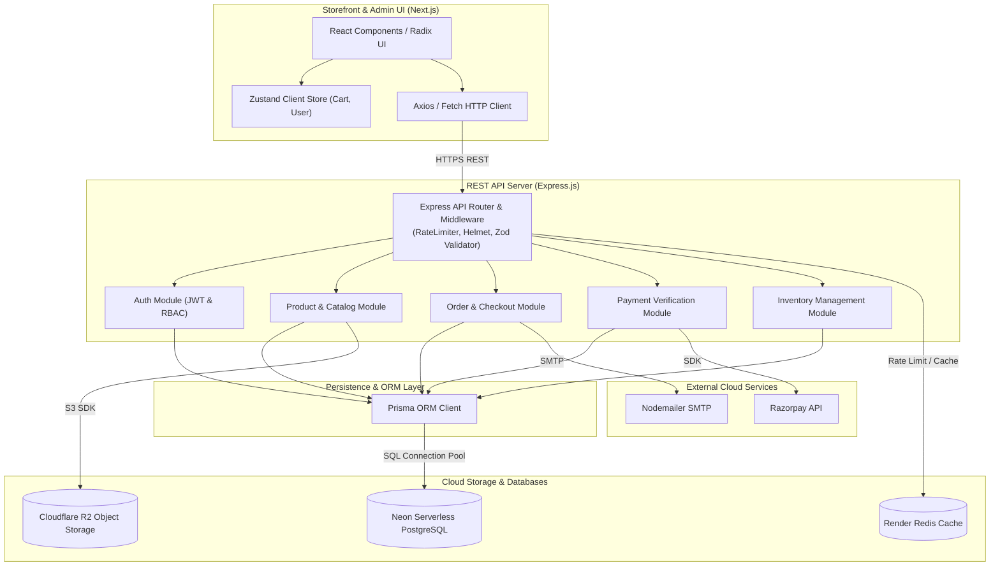
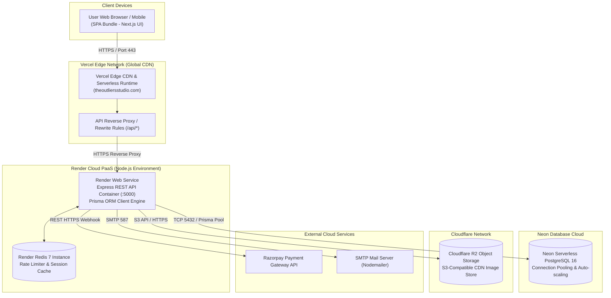
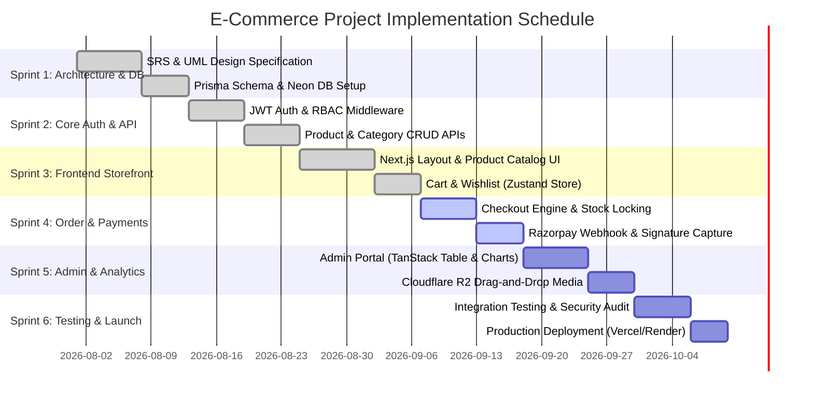

# Practical 3: UML Design & Software Architecture for E-Commerce System (Tevar)

---

## 1. Problem Analysis & Requirement Gathering (SRS Overview)

### 1.1 Problem Statement
Modern fashion e-commerce requires high-availability browsing, instant inventory reservation, secure multi-channel payments, and role-based administrative control. Traditional monolithic web applications suffer from scalability bottlenecks during flash sales, tight coupling between catalog and order management, and inadequate real-time state synchronization.

### 1.2 System Objectives
* **Scalable Micro-Modular Architecture:** Decouple customer-facing storefronts (Next.js/Vercel) from core business logic (Express REST API on Render).
* **Guaranteed ACID Transactions:** Maintain data integrity across order creation, inventory stock deduction, and payment capture.
* **Low Latency Catalog Search & Asset Delivery:** Zero-egress CDN storage (Cloudflare R2) and Redis-backed rate limiting & caching.
* **Role-Based Access Control (RBAC):** Distinct permissions for `CUSTOMER`, `ADMIN`, and `SUPER_ADMIN`.

### 1.3 Functional Requirements (FR)
| ID | Requirement Name | Description | Actors Involved |
| :--- | :--- | :--- | :--- |
| **FR-01** | User Authentication & Profile | Register, login via JWT (Access + Refresh token), manage addresses. | Customer, Admin |
| **FR-02** | Catalog Browsing & Search | Filter products by category, size, price, and full-text keyword search. | Customer, Guest |
| **FR-03** | Cart & Wishlist Management | Add/remove items, update quantities, persist cart in session/database. | Customer |
| **FR-04** | Order Lifecycle & Checkout | Create order, validate stock, compute taxes/coupons, initiate payment. | Customer, System |
| **FR-05** | Payment Gateway Integration | Process payments via Razorpay webhook signature verification. | Customer, Razorpay, System |
| **FR-06** | Inventory & Stock Control | Auto-decrement stock upon order placement, restock on payment failure/cancellation. | System, Admin |
| **FR-07** | Admin Operations & Analytics | Manage products, view sales reports, update shipping tracking statuses. | Admin, Super Admin |

### 1.4 Non-Functional Requirements (NFR)
* **Performance:** API response time $< 150\text{ ms}$ for $95\%$ of catalog requests.
* **Security:** OWASP compliance, Helmet headers, CORS policies, Bcrypt password hashing (12 rounds), JWT tokens.
* **Availability & Reliability:** $99.9\%$ uptime leveraging serverless Neon PostgreSQL and edge-routed Vercel CDN.
* **Maintainability:** Modular Layered Architecture (Controller $\rightarrow$ Service $\rightarrow$ Data Access Layer with Prisma ORM).

---

## 2. UML Diagrams & Modeling

---

### 2.1 Use Case Diagram
Illustrates interactions between system actors (Guest, Customer, Admin, Payment Gateway) and system features.

```mermaid
usecaseDiagram
%% Actor definitions
actor Customer as "Customer / User"
actor Admin as "Store Admin"
actor Razorpay as "Payment Gateway"
actor NotificationService as "Email / SMS Service"

rectangle "Tevar E-Commerce System" {
    usecase UC_Auth as "Authenticate (Login / Register / JWT)"
    usecase UC_Browse as "Browse / Search Products"
    usecase UC_Cart as "Manage Cart & Wishlist"
    usecase UC_Checkout as "Checkout & Place Order"
    usecase UC_Pay as "Process Payment"
    usecase UC_Track as "Track Order Status"
    usecase UC_ApplyCoupon as "Apply Discount Coupon"
    usecase UC_ManageInventory as "Manage Products & Inventory"
    usecase UC_ManageOrders as "Update Fulfillment & Shipping"
    usecase UC_ViewAnalytics as "View Sales & Revenue Analytics"
    usecase UC_SendReceipt as "Send Order Confirmation"
}

%% Customer associations
Customer --> UC_Auth
Customer --> UC_Browse
Customer --> UC_Cart
Customer --> UC_Checkout
Customer --> UC_Track

%% Inclusions and Extensions
UC_Checkout ..> UC_Pay : <<include>>
UC_Checkout ..> UC_ApplyCoupon : <<extend>>
UC_Pay ..> UC_SendReceipt : <<include>>

%% External Actor associations
UC_Pay --> Razorpay
UC_SendReceipt --> NotificationService

%% Admin associations
Admin --> UC_Auth
Admin --> UC_ManageInventory
Admin --> UC_ManageOrders
Admin --> UC_ViewAnalytics
```

---

### 2.2 Class Diagram
Models the structural domain entities, attributes, methods, and relationships within the backend database schema.



---

### 2.3 Activity Diagram (Order Placement & Checkout Flow)
Models the dynamic workflow from cart checkout to payment validation and order finalization.



---

### 2.4 Sequence Diagram (Checkout & Payment Verification)
Details time-ordered message exchanges across Client, API Controller, Payment Gateway, and Database.



---

### 2.5 State Machine Diagram (Order Lifecycle)
Represents the distinct states of an `Order` entity and the triggers driving state transitions.



---

### 2.6 Component Diagram
Depresents the high-level structural decomposition and interface boundaries of the software subsystems.



---

### 2.7 Deployment Diagram
Shows physical node allocation, networking topologies, CDNs, and server environments.



---

## 3. Software Engineering Tools & Technologies

| Category | Tool / Framework | Purpose & Usage in Project |
| :--- | :--- | :--- |
| **Frontend Framework** | Next.js 16 + React 19 | Server-Side Rendering (SSR), App Router, dynamic routing. |
| **Styling & Design** | Tailwind CSS v4 + Radix UI | Responsive styling, design tokens, accessible dialogs/menus. |
| **Backend Framework** | Node.js + Express.js | Modular RESTful API routing, business logic orchestration. |
| **ORM & Database** | Prisma ORM + Neon PostgreSQL | Type-safe schema migrations, queries, and relations. |
| **Caching & Security** | Redis + Helmet + Rate-Limiter | Session caching, distributed rate-limiting, security headers. |
| **Storage & Assets** | Cloudflare R2 | S3-compatible, high-throughput image asset storage. |
| **Version Control & CI/CD** | Git + GitHub + GitHub Actions | Feature branch workflows, linting, automated testing & deployment. |
| **API Testing & Docs** | Postman / Thunder Client | REST endpoint functional testing and contract validation. |
| **UML & Diagrams** | Mermaid.js / Draw.io / PlantUML | System architectural modeling and documentation. |

---

## 4. Project Planning & Management Artifacts

### 4.1 Work Breakdown Structure (WBS)
```
1.0 Tevar E-Commerce System
 ├── 1.1 Requirements & System Architecture
 │    ├── 1.1.1 Problem analysis & SRS documentation
 │    └── 1.1.2 UML structural & behavioral modeling
 ├── 1.2 Frontend Development (Storefront & Admin)
 │    ├── 1.2.1 Design system & responsive layout (Tailwind + Radix)
 │    ├── 1.2.2 Product catalog, search & filtering UI
 │    ├── 1.2.3 Zustand Cart, Wishlist & Checkout flows
 │    └── 1.2.4 Admin dashboard (Analytics, Inventory table)
 ├── 1.3 Backend API & Database
 │    ├── 1.3.1 Prisma schema definition & Neon DB migrations
 │    ├── 1.3.2 JWT Authentication & RBAC middleware
 │    ├── 1.3.3 Products, Categories & Media upload (Cloudflare R2)
 │    └── 1.3.4 Orders, Razorpay webhook & transactional stock decrement
 ├── 1.4 Testing & Quality Assurance
 │    ├── 1.4.1 Unit & integration tests (Supertest + Jest)
 │    ├── 1.4.2 End-to-End checkout validation & payment mocking
 │    └── 1.4.3 Security audits (OWASP Top 10, rate limiting)
 └── 1.5 Deployment & Cloud Infrastructure
      ├── 1.5.1 Vercel Edge frontend setup & API route rewrites
      └── 1.5.2 Render Web Service & Redis instance provisioning
```

---

### 4.2 Gantt Chart (6-Sprint Agile Release Schedule)



---

## 5. Testing Artifacts & Quality Assurance

### 5.1 Test Cases Specification

| Test ID | Module / Feature | Test Description | Input Data | Expected Output | Status |
| :--- | :--- | :--- | :--- | :--- | :--- |
| **TC-01** | Authentication | Register user with existing email | `{ email: "existing@brand.com" }` | `409 Conflict`, "Email already in use" | **PASS** |
| **TC-02** | Catalog | Filter products by non-existent size | `GET /api/products?size=XXXXL` | `200 OK`, `products: []` | **PASS** |
| **TC-03** | Inventory | Checkout item when stock is 0 | Variant Qty = 1, Stock = 0 | `400 Bad Request`, "Out of stock" | **PASS** |
| **TC-04** | Payment | Webhook with altered signature | Tampered Razorpay payload | `400 Bad Request`, Signature invalid | **PASS** |
| **TC-05** | Security | Rate limiting trigger | > 100 requests in 1 minute | `429 Too Many Requests` | **PASS** |

### 5.2 Bug Report Sample

* **Bug ID:** `BUG-2026-084`
* **Module:** `Orders / Stock Reservation`
* **Severity:** `High` | **Priority:** `P1`
* **Summary:** Concurrency race condition allowed double-decrement of inventory during simultaneous checkout.
* **Steps to Reproduce:**
  1. Open two browser sessions with 1 item remaining in stock.
  2. Click "Pay" simultaneously in both sessions.
* **Root Cause:** Missing database transaction locking during stock validation.
* **Resolution:** Wrapped order creation and variant decrement in `prisma.$transaction([ ... ])`.

---

## 6. GitHub Repository & Version Control Strategy

* **Git Flow Strategy:**
  * `main`: Production-ready release code. Automatic deploy to Vercel/Render production environments.
  * `develop`: Integration branch for finished sprint features.
  * `feature/*` (`feature/razorpay-integration`): Feature-specific development branches.
  * `hotfix/*`: Direct fixes for production issues.
* **Commit Message Standard:** Conventional Commits (`feat:`, `fix:`, `docs:`, `refactor:`, `test:`).
* **Branch Protection Rules:** Require pull request reviews, passing GitHub Actions CI build checks before merging.

---

## 7. Viva & Practical Presentation Q&A

**Q1: Why did you choose a decoupled architecture (Next.js on Vercel + Express on Render) instead of Next.js fullstack API routes?**  
> *Answer:* Decoupling separates concerns: the frontend benefits from global edge CDN caching and fast SSR on Vercel, while the backend maintains long-lived TCP connection pools to Neon PostgreSQL and Redis without serverless cold starts or timeout limits on background jobs.

**Q2: How do you handle race conditions during inventory checkout?**  
> *Answer:* We employ Prisma ACID interactive transactions (`prisma.$transaction`). The stock quantity is conditionally verified and decremented atomically. If stock is insufficient at the moment of execution, the entire transaction rolls back.

**Q3: How does the system ensure payment security?**  
> *Answer:* The backend computes an HMAC-SHA256 hash using the secret key, `razorpay_order_id`, and `razorpay_payment_id`, comparing it against the received signature before marking the order as confirmed and releasing the digital invoice.
