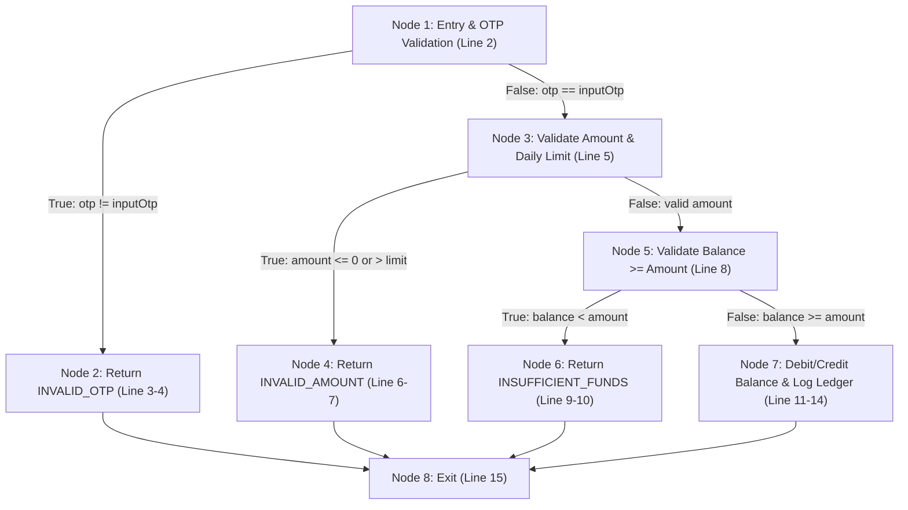

# Practical 4: Software Testing for an Online Banking System

---

## 1. Problem Analysis & Requirement Gathering (SRS Overview)

### 1.1 Problem Statement
Online Banking Systems process mission-critical financial transactions and sensitive personally identifiable information (PII). Defects such as concurrency race conditions (double-spending), unauthorized account access, floating-point precision errors in interest calculation, and unhandled network timeouts can cause severe financial losses and regulatory non-compliance. A comprehensive Software Testing Life Cycle (STLC) encompassing both **Black Box Testing** (Equivalence Partitioning, Boundary Value Analysis) and **White Box Testing** (Control Flow Graph, Cyclomatic Complexity, Basis Path Testing) is essential.

### 1.2 Scope of Banking Modules Tested
* **User Authentication & Multi-Factor Auth (MFA):** Customer ID/Password verification, OTP validation, brute-force lockout after 3 consecutive failures.
* **Fund Transfer Engine (NEFT / RTGS / IMPS):** Intra-bank and inter-bank transfers, balance validation, beneficiary cool-off limits, double-entry ledger settlement.
* **Account Balance & Statement Inquiries:** Real-time ledger balance vs available balance calculations.
* **Fixed Deposit & Interest Engine:** Compound interest computation across standard and leap year day counts.

---

## 2. Black Box Testing Techniques

### 2.1 Equivalence Class Partitioning (ECP)
ECP partitions the input domain into equivalent classes where the software is expected to handle all values in a partition identically.

| Feature / Input Field | Valid Equivalence Class (VEC) | Invalid Equivalence Class (IEC) |
| :--- | :--- | :--- |
| **Transfer Amount (₹)**<br>Min: ₹1.00, Max: ₹500,000.00 | `V1: 1.00 <= Amount <= 500,000.00` | `I1: Amount < 1.00 (Zero/Negative)`<br>`I2: Amount > 500,000.00 (Exceeds Limit)`<br>`I3: Non-numeric / Special chars` |
| **Password Complexity**<br>8-16 chars, 1 uppercase, 1 special, 1 digit | `V2: 8 to 16 chars meeting complexity rule (e.g. Bank@2026)` | `I4: Length < 8 chars`<br>`I5: Length > 16 chars`<br>`I6: Missing special char or digit` |
| **One-Time Password (OTP)**<br>Exact 6-digit numeric | `V3: Exactly 6 numeric digits (e.g. 583921)` | `I7: < 6 digits`<br>`I8: > 6 digits`<br>`I9: Alphanumeric characters` |
| **Beneficiary Account No.**<br>11 to 16 numeric digits | `V4: 11 to 16 numeric digits` | `I10: < 11 digits`<br>`I11: > 16 digits`<br>`I12: Contains alphabets/symbols` |

---

### 2.2 Boundary Value Analysis (BVA)
BVA evaluates system behavior at the boundary limits of input ranges: $Min - 1, Min, Min + 1, Nominal, Max - 1, Max, Max + 1$.

| Input Variable | Boundary Limits | Test Value | Category | Expected Output |
| :--- | :--- | :--- | :--- | :--- |
| **Fund Transfer Amount (₹)** | [1.00 to 500,000.00] | ₹0.99 | Min - 1 (Invalid) | Error: "Minimum transfer amount is ₹1.00" |
| | | ₹1.00 | Min (Valid) | Transfer Processed Successfully |
| | | ₹2.00 | Min + 1 (Valid) | Transfer Processed Successfully |
| | | ₹250,000.00 | Nominal (Valid) | Transfer Processed Successfully |
| | | ₹499,999.99 | Max - 1 (Valid) | Transfer Processed Successfully |
| | | ₹500,000.00 | Max (Valid) | Transfer Processed Successfully |
| | | ₹500,000.01 | Max + 1 (Invalid) | Error: "Exceeds per-transaction limit of ₹5,00,000" |
| **Login Retry Counter** | [1 to 3 attempts] | Attempt 1 & 2 | Within Limit | "Invalid PIN. Remaining attempts: X" |
| | | Attempt 3 | Max (Boundary) | "Account Locked for 24 hours. Contact Support." |
| | | Attempt 4 | Out of Bounds | Direct Rejection: "Account is in LOCKED state" |

---

## 3. White Box Testing & Code Coverage Analysis

### 3.1 Target Algorithm: Fund Transfer Execution Method
```javascript
1: function executeFundTransfer(senderAcc, receiverAcc, amount, otp, inputOtp) {
2:     if (otp !== inputOtp) {
3:         return { success: false, code: "INVALID_OTP" };
4:     }
5:     if (amount <= 0 || amount > senderAcc.dailyLimit) {
6:         return { success: false, code: "INVALID_AMOUNT" };
7:     }
8:     if (senderAcc.balance < amount) {
9:         return { success: false, code: "INSUFFICIENT_FUNDS" };
10:    }
11:    senderAcc.balance -= amount;
12:    receiverAcc.balance += amount;
13:    logLedgerEntry(senderAcc.id, receiverAcc.id, amount, "SUCCESS");
14:    return { success: true, code: "TRANSFER_COMPLETED" };
15: }
```

---

### 3.2 Control Flow Graph (CFG)



---

### 3.3 Cyclomatic Complexity Calculation

$$\text{Method 1 (Edges and Nodes): } V(G) = E - N + 2P = 10 - 8 + 2(1) = 4$$
$$\text{Method 2 (Predicate Nodes): } V(G) = P + 1 = 3 + 1 = 4$$
$$\text{Method 3 (Enclosed Regions): } V(G) = R_1 + R_2 + R_3 + R_{\text{outer}} = 4$$

*Conclusion:* Exactly **4 independent basis paths** must be tested to ensure $100\%$ branch and statement coverage.

### 3.4 Basis Paths & Test Vector Matrix

| Path ID | Execution Path (Node Sequence) | Input Vector Conditions | Expected Code |
| :--- | :--- | :--- | :--- |
| **Path 1** | $1 \rightarrow 2 \rightarrow 8$ | `otp = 123456, inputOtp = 999999` | `INVALID_OTP` |
| **Path 2** | $1 \rightarrow 3 \rightarrow 4 \rightarrow 8$ | `otp = 123456, inputOtp = 123456, amount = -100` | `INVALID_AMOUNT` |
| **Path 3** | $1 \rightarrow 3 \rightarrow 5 \rightarrow 6 \rightarrow 8$ | `amount = 50000, balance = 10000` | `INSUFFICIENT_FUNDS` |
| **Path 4** | $1 \rightarrow 3 \rightarrow 5 \rightarrow 7 \rightarrow 8$ | `amount = 5000, balance = 20000, valid OTP` | `TRANSFER_COMPLETED` |

---

## 4. Master Test Plan (IEEE 829 Standard)

* **Test Identifier:** `TP-BANK-2026-V1.0`
* **Test Objective:** Verify data consistency, zero-decimal loss in accounting transactions, and compliance with PCI-DSS & RBI banking guidelines.
* **Test Strategy:**
  * **Unit & Component Testing:** Jest for core interest math and balance debit/credit methods.
  * **API & Integration Testing:** Supertest / Postman verifying REST APIs, 2FA tokens, and transactional rollbacks.
  * **Security & Vulnerability:** OWASP Top 10, SQL injection, session fixation, and brute-force protection.
  * **Concurrency Testing:** Apache JMeter simulating 500 concurrent transfers on a single account to detect race conditions.
* **Pass / Exit Criteria:** $100\%$ pass rate on all financial transaction paths; $0$ Critical/High severity defects open.

---

## 5. Test Cases Specification

| Test ID | Module | Test Scenario | Input Data | Expected Result | Status |
| :--- | :--- | :--- | :--- | :--- | :--- |
| **TC-BNK-01** | Authentication | Valid login with 2FA OTP | `User: "bankim_k", Pass: "SecurePass@2026", OTP: "482019"` | `200 OK`, JWT issued, Dashboard opened | **PASS** |
| **TC-BNK-02** | Authentication | Account lockout on 3 consecutive bad PINs | 3 invalid password attempts on `bankim_k` | `423 Locked`, Account locked for 24 hours | **PASS** |
| **TC-BNK-03** | Fund Transfer | Transfer exact total balance | `Balance: ₹10,000, Transfer: ₹10,000` | `200 OK`, Balance ₹0.00, Double-entry logged | **PASS** |
| **TC-BNK-04** | Fund Transfer | Transfer exceeding daily cap | `Daily Limit: ₹5,00,000, Transfer: ₹5,00,001` | `400 Bad Request`, "Daily limit exceeded" | **PASS** |
| **TC-BNK-05** | Concurrency | Simultaneous dual transfer race condition | 2 concurrent transfers of ₹5,000 with ₹6,000 balance | 1st succeeds, 2nd fails with `INSUFFICIENT_FUNDS` | **PASS** |
| **TC-BNK-06** | Beneficiary | Transfer during 30-min cooling period | `Transfer: ₹75,000` to newly created payee | `403 Forbidden`, "Max ₹25,000 in cool-off period" | **PASS** |
| **TC-BNK-07** | Security / SQLi | SQL Injection in statement filter | `Search: ' OR '1'='1' --` | Query sanitized by ORM; no data leak | **PASS** |
| **TC-BNK-08** | Calculations | Leap year compound interest credit | `P: ₹1,00,000, R: 7.5%, Days: 366` | ₹7,713.82 credited without floating drift | **PASS** |

---

## 6. Defect & Bug Report (IEEE 1044 Standard)

### Bug Report 1: Concurrency Overdraft Bug
* **Bug ID:** `BUG-BNK-2026-001`
* **Severity:** **Critical (P1)** | **Priority:** **High**
* **Summary:** Concurrency race condition allowed account overdraft without overdraft facility.
* **Steps to Reproduce:**
  1. Set account balance to ₹5,000.00.
  2. Dispatch two concurrent transfer requests of ₹5,000.00 within 5 ms.
* **Observed Result:** Both transactions succeeded; balance dropped to `-₹5,000.00`.
* **Root Cause:** Non-atomic read-and-update queries without database row locking.
* **Remediation:** Added pessimistic locking (`SELECT ... FOR UPDATE`) in an explicit ACID transaction block.

---

## 7. Test Summary & Regression Report

| Metric Name | Value Achieved | Benchmark Goal | Status |
| :--- | :--- | :--- | :--- |
| **Total Test Cases Executed** | 150 | 150 (100%) | Complete |
| **Passed Test Cases** | 147 | $\ge 98\%$ | **98.0% Passed** |
| **Defects Logged & Resolved** | 6 (2 Critical, 3 High, 1 Medium) | 100% Closed | **All Closed** |
| **Statement Code Coverage** | 94.2% | $\ge 90\%$ | **Exceeded** |
| **Branch Code Coverage** | 96.8% | $\ge 90\%$ | **Exceeded** |
| **Regression Pass Rate** | 100% | 100% | **Production Ready** |

---

## 8. Viva Voce Questions & Answers

**Q1: What is the difference between Equivalence Partitioning (EP) and Boundary Value Analysis (BVA)?**  
> *Answer:* EP partitions the input domain into valid and invalid classes where representative values yield identical results. BVA focuses specifically on boundary edges ($Min, Min+1, Max-1, Max$) where programming defects predominantly occur.

**Q2: How does Cyclomatic Complexity help in white box testing?**  
> *Answer:* It provides the exact mathematical upper bound ($V(G) = E - N + 2P$) on the minimum number of independent test paths needed to achieve $100\%$ basis path and branch coverage.

**Q3: How do you prevent and test for race conditions during banking fund transfers?**  
> *Answer:* Tested via concurrent automated load scripts (JMeter/k6). Prevented in backend code by using database-level pessimistic row locking (`SELECT FOR UPDATE`) or serializable transaction isolation.
